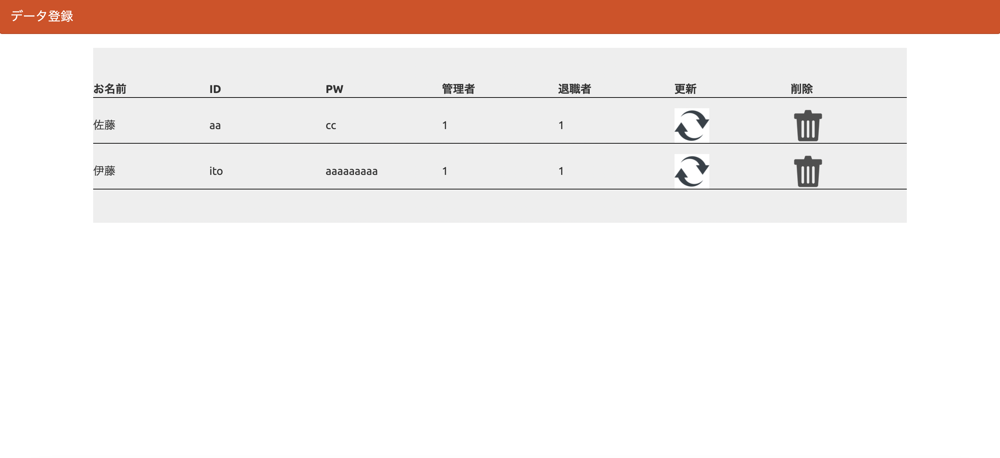

# １、課題内容

phpデータベースの課題。

# ２、工夫した点

- 課題2では削除と更新部分に画像を入れられるようにしました。

# ３、参考にしたURL

[table-layout](https://dekiru.net/article/13215/)

# 4、データベース情報

- 課題1

  データベース　 :gs_book_db

  テーブル　    :gs_bm_table

- 課題2

  データベース　 :gs_db

  テーブル　    :gs_user_table

# 5、反省点

- 課題1

  detail.phpのinputタグにvalue=<?= $view['comment']?>が抜けていた為、追記を実施
